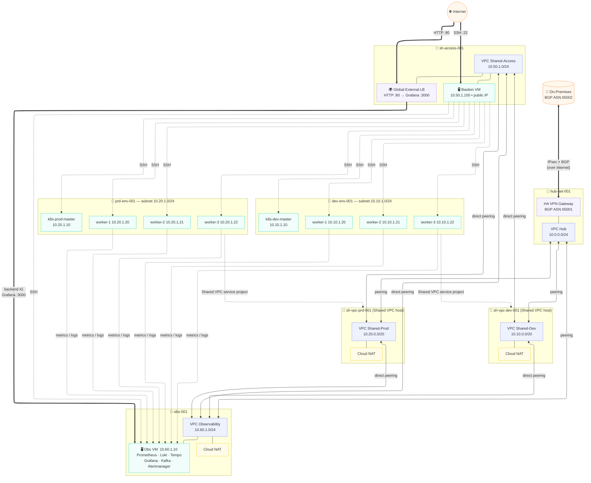

# GCP Landing Zone — Terraform Infrastructure

Terraform codebase for a GCP Hub-Spoke Landing Zone including VPC networking, Kubernetes clusters (dev/prod), centralized observability, HA VPN to on-premises, and Global External Load Balancing.

---

## Architecture



---

## Prerequisites

### 1. Tools
*   Terraform `>= 1.5.0`
*   Google Cloud SDK (`gcloud`)

### 2. Multi-Billing Setup (Free Tier Quota)
To stay within GCP Free Tier project quotas, this infra is split across two billing accounts:
*   **Billing Account 1**: Managed Hub, Access, and Observability projects.
*   **Billing Account 2**: Managed Dev and Prod host/service projects.

### 3. Automated Initialization
Run the setup script in **GCP Cloud Shell** to create the entire Folder/Project hierarchy and the GCS State bucket:

```bash
# In Cloud Shell
chmod +x setup-gcp.sh
./setup-gcp.sh
```

---

## Configuration

1.  **Backend**: Terraform state is stored in `gs://gcp-apse1-tf-state-54431047904` (configured in `backend.tf`).
2.  **Variables**: Copy `terraform.tfvars.example` to `terraform.tfvars`.
3.  **Sensitive Data**: Fill in `user_email`, `vpn_shared_secrets`, and `onprem_vpn_public_ips` in `terraform.tfvars`.

---

## Deploy

```bash
terraform init
terraform plan
terraform apply
```

---

## Essential Outputs

After deployment, use these values for your Ansible inventory and access:

| Output | Description |
|---|---|
| `bastion_host_public_ip` | Entry point for SSH/Ansible. |
| `load_balancer_ip` | Access Grafana Dashboard at `http://<ip>`. |
| `observability_vm_private_ip` | Internal IP of Obs VM for metric collection. |
| `vpn_gateway_interface_0_ip` | Peer IP 1 for on-prem VPN config. |
| `vpn_gateway_interface_1_ip` | Peer IP 2 for on-prem VPN config. |

---

## File Structure

*   `setup-gcp.sh`: Automation for folders/projects/billing.
*   `backend.tf`: GCS remote state config.
*   `compute-*.tf`: Modularized network, peering, firewall, and VM resources.
*   `cloud-*.tf`: VPN, NAT, Load Balancing, Logging, and Monitoring.
*   `iam.tf`: Service account and role management.
