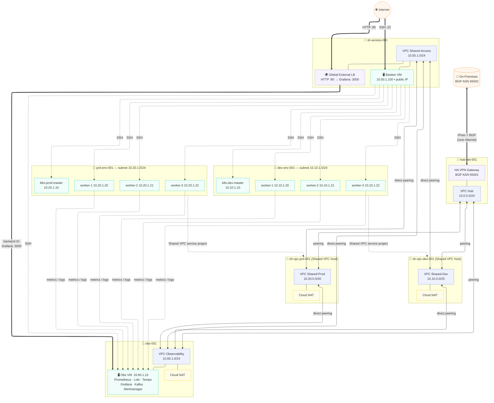

# GCP Landing Zone — Terraform Infrastructure

Terraform codebase for a GCP Hub-Spoke Landing Zone including VPC networking, Kubernetes clusters (dev/prod), centralized observability, HA VPN to on-premises, and Global External Load Balancing.

---

## Architecture



---

## File Structure

```
terraform-code/
├── providers.tf            # Terraform & Google provider version constraints
├── variables.tf            # All input variables (org_id, project IDs, secrets...)
├── terraform.tfvars.example  # Template — copy to terraform.tfvars and fill in
│
├── resource-manager.tf     # data sources for pre-existing folders & projects
├── service-usage.tf        # GCP API enablement for each project
├── org-policies.tf         # Org-level policies (OS Login, no default VPC, no external IP)
│
├── compute-network.tf      # VPC networks + subnets (5 VPCs)
├── compute-peering.tf      # VPC peering pairs (14 bidirectional pairs)
├── compute-shared-vpc.tf   # Shared VPC host/service project bindings
├── compute-firewall.tf     # All firewall rules (SSH, internal, LB health check, VPN)
├── compute-engine.tf       # VM instances (K8s masters/workers, Bastion, Obs VM)
│
├── cloud-vpn.tf            # HA VPN Gateway, tunnels, BGP peers
├── cloud-nat.tf            # Cloud NAT for dev, prod, observability VPCs
├── cloud-load-balancing.tf # Global External LB → Grafana backend
├── cloud-logging.tf        # GCS/BigQuery log sinks, Loki/Tempo buckets
├── cloud-monitoring.tf     # Uptime checks, alert policies, notification channels
│
├── iam.tf                  # Per-project service accounts + IAM roles
└── outputs.tf              # Exported values (IPs, project IDs, SA emails)
```

---

## Projects Overview

| Project | Role | VPC / Subnet |
|---|---|---|
| `hub-net-001` | HA VPN + Cloud Router | `10.0.0.0/24` |
| `sh-access-001` | Bastion Host + Global External LB | `10.50.1.0/24` |
| `sh-vpc-dev-001` | Shared VPC **host** for dev | `10.10.0.0/20` |
| `sh-vpc-prd-001` | Shared VPC **host** for prod | `10.20.0.0/20` |
| `dev-env-001` | K8s cluster (service project) | `10.10.1.0/24` |
| `prd-env-001` | K8s cluster (service project) | `10.20.1.0/24` |
| `obs-001` | Observability stack | `10.60.1.0/24` |

> Projects and folders are **managed manually** — Terraform only manages resources *inside* them.

---

## Prerequisites

### 1. Tools

| Tool | Minimum version | Install |
|---|---|---|
| Terraform | `>= 1.5.0` | https://developer.hashicorp.com/terraform/install |
| Google Cloud SDK (`gcloud`) | latest | https://cloud.google.com/sdk/docs/install |

### 2. GCP Authentication

Authenticate with an account that has **Organization Admin** or sufficient permissions:

```bash
gcloud auth login
gcloud auth application-default login
```

### 3. Create Folders & Projects Manually

Terraform uses `data "google_project"` — it **does not create** projects. You must create them first:

```bash
# Create folders
gcloud resource-manager folders create --display-name="network-hub"   --organization=YOUR_ORG_ID
gcloud resource-manager folders create --display-name="shared-vpc"    --organization=YOUR_ORG_ID
gcloud resource-manager folders create --display-name="dev"           --organization=YOUR_ORG_ID
gcloud resource-manager folders create --display-name="prod"          --organization=YOUR_ORG_ID
gcloud resource-manager folders create --display-name="observability" --organization=YOUR_ORG_ID

# Create projects (replace FOLDER_IDs with actual values from above)
gcloud projects create gcp-apse1-prj-hub-net-001    --folder=FOLDER_NETWORK_HUB_ID
gcloud projects create gcp-apse1-prj-sh-access-001  --folder=FOLDER_NETWORK_HUB_ID
gcloud projects create gcp-apse1-prj-sh-vpc-dev-001 --folder=FOLDER_SHARED_VPC_ID
gcloud projects create gcp-apse1-prj-sh-vpc-prd-001 --folder=FOLDER_SHARED_VPC_ID
gcloud projects create gcp-apse1-prj-dev-env-001    --folder=FOLDER_DEV_ID
gcloud projects create gcp-apse1-prj-prd-env-001    --folder=FOLDER_PROD_ID
gcloud projects create gcp-apse1-prj-obs-001        --folder=FOLDER_OBS_ID

# Link billing to each project
for PROJECT in hub-net-001 sh-access-001 sh-vpc-dev-001 sh-vpc-prd-001 dev-env-001 prd-env-001 obs-001; do
  gcloud billing projects link gcp-apse1-prj-${PROJECT} \
    --billing-account=YOUR_BILLING_ACCOUNT_ID
done
```

### 4. Enable cloudresourcemanager API (required for Terraform)

```bash
for PROJECT in hub-net-001 sh-access-001 sh-vpc-dev-001 sh-vpc-prd-001 dev-env-001 prd-env-001 obs-001; do
  gcloud services enable cloudresourcemanager.googleapis.com \
    --project=gcp-apse1-prj-${PROJECT}
done
```

### 5. Configure terraform.tfvars

```bash
cp terraform.tfvars.example terraform.tfvars
```

Edit `terraform.tfvars` and fill in all values:

```hcl
org_id          = "123456789012"
billing_account = "012345-ABCDEF-012345"
user_email      = "your-account@gmail.com"

project_id_hub_net    = "gcp-apse1-prj-hub-net-001"
project_id_sh_access  = "gcp-apse1-prj-sh-access-001"
project_id_sh_vpc_dev = "gcp-apse1-prj-sh-vpc-dev-001"
project_id_sh_vpc_prd = "gcp-apse1-prj-sh-vpc-prd-001"
project_id_dev_env    = "gcp-apse1-prj-dev-env-001"
project_id_prd_env    = "gcp-apse1-prj-prd-env-001"
project_id_obs        = "gcp-apse1-prj-obs-001"

vpn_shared_secret_1   = "your-strong-secret-1"
vpn_shared_secret_2   = "your-strong-secret-2"
```

> ⚠️ **Never commit `terraform.tfvars`** — it is listed in `.gitignore`.

### 6. Update On-Premises BGP Peer IP (cloud-vpn.tf)

Open `cloud-vpn.tf` and replace the placeholder on-prem VPN gateway IPs:

```hcl
# Find and replace:
ip_address = "203.0.113.1"   # ← replace with actual on-prem VPN peer IP (interface 0)
ip_address = "203.0.113.2"   # ← replace with actual on-prem VPN peer IP (interface 1)
```

---

## Deploy

```bash
# Initialize providers and modules
terraform init

# Preview changes (dry run)
terraform plan

# Apply infrastructure
terraform apply
```

---

## Destroy (Dev only)

```bash
terraform destroy
```

> After destroy, projects remain on GCP in **soft-delete** state for 30 days.
> To redeploy with the same project IDs immediately, go to **GCP Console → IAM & Admin → Manage Resources** and **Purge** the deleted projects first.

---

## Key Outputs

After `terraform apply`, the following values are printed:

| Output | Description |
|---|---|
| `bastion_host_public_ip` | SSH entry point — use this for Ansible |
| `load_balancer_ip` | Global External LB IP — access Grafana at `http://<ip>` |
| `vpn_gateway_interface_0_ip` | HA VPN public IP (configure on on-prem side) |
| `vpn_gateway_interface_1_ip` | HA VPN public IP (configure on on-prem side) |
| `observability_vm_private_ip` | Obs VM private IP for Ansible inventory |
| `sa_*_email` | Service account emails per project |

```bash
# View all outputs
terraform output

# View specific output
terraform output bastion_host_public_ip
```

---

## Notes

- **VPC Peering is non-transitive** — direct peerings are added between Access↔Dev, Access↔Prod, Access↔Obs, Dev↔Obs, Prod↔Obs to work around this GCP limitation.
- **K8s LoadBalancer services** — firewall rules for NodePort range `30000–32767` are pre-configured so future K8s `type: LoadBalancer` services work without additional rules.
- **Grafana LB** — currently the only active backend. K8s services will create their own LBs when deployed.
